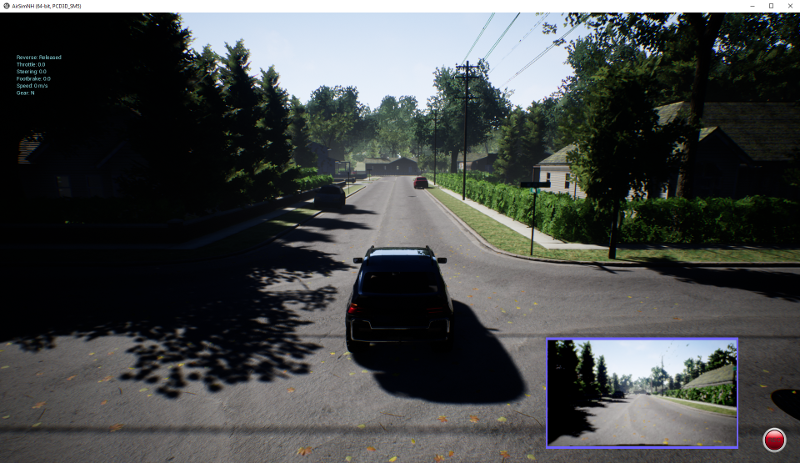

# Collision Avoidance with AirSim

<a href="https://www.youtube.com/watch?v=9bEPKMctNpI"></a>

Reference: https://github.com/simondlevy/AirSimTensorFlow

This repository demonstrates how to use [Microsoft AirSim](https://github.com/Microsoft/AirSim) to collect image data from a simulated vehicle, train a neural network using TensorFlow, and perform real-time collision detection and multi-car simulations.

---

## 🧰 Prerequisites

- **Hardware:** [Recommended hardware](https://wiki.unrealengine.com/Recommended_Hardware) for Unreal Engine 4 is required for running AirSim. We recommend using the precompiled [AirSimNH Windows binary](https://github.com/Microsoft/AirSim/releases/download/v1.1.7/Neighbourhood.zip).
- **Python:** Use Python **3.8 (64-bit)** to ensure compatibility with TensorFlow and other dependencies.
- **Simulator:** [AirSim](https://github.com/Microsoft/AirSim), launched via `run.bat` in the AirSimNH folder.

---

## ⚙️ Setting Up the Conda Environment

To isolate dependencies and ensure compatibility, create and activate a Conda environment named `games`:

```bash
conda create -n games python=3.8
conda activate games
```

---

## 🧪 Installing Dependencies

After activating the environment, AirSim 1.8.1 must see `numpy` and `msgpack` during its source build. Install those first, then the rest:

```bash
pip install numpy==1.24.3 msgpack-rpc-python==0.4.1 msgpack-python==0.5.6
pip install -r requirements.txt
```

Key pins include:

- `tensorflow==2.13.0` (uses `tensorflow.compat.v1`)
- `numpy==1.24.3`
- `airsim==1.8.1` (built from source; needs numpy/msgpack present during build)
- `opencv-contrib-python==4.11.0.86`
- plus supporting packages in `requirements.txt`

Why preinstall `numpy`/`msgpack` when they’re already in `requirements.txt`? AirSim is only distributed as a source tarball, and its `setup.py` imports those modules before pip installs anything else. Preinstalling them (or disabling pip build isolation) ensures the AirSim build can import its prerequisites. They remain in `requirements.txt` to document the exact versions and so repeated installs stay consistent; pip will simply report them as already satisfied once they’re present.

---

## 🚀 Instructions for Running the Project

### 1. `image_collection.py`

- Launch AirSimNH using `run.bat`
- Run this script to start collecting first-person-view images
- The car drives forward and saves images to the `carpix` directory
- Stops when a collision is detected

### 2. `collision_training.py`

- Converts images to grayscale
- Labels them as “safe” or “collision”
- Trains a softmax neural network with TensorFlow
- Saves the model parameters as `params.pkl`

### 3. `collision_testing.py`

- Loads `params.pkl`
- Reconstructs the trained network
- Feeds live images from AirSim
- Stops the vehicle before collision is predicted

### 4. `CollisionAvoidance.py`

- Creates a second car that backs out of a parking space
- Runs in parallel with the main car using threads
- Includes potential for further autonomous behaviors

---

## 🧠 How It Works

- Images collected before a crash are labeled "safe", and the final image is labeled "collision"
- A softmax neural net is trained using TensorFlow 1.x API via `tensorflow.compat.v1`
- The trained model is saved using `pickle`
- During testing, live images are passed through the model to predict collisions and apply brakes
- `CollisionAvoidance.py` demonstrates multi-car behavior using AirSim APIs

---

## 🧊 Freezing Your Environment (Optional)

After setup, you can freeze your environment to recreate it later:

```bash
pip freeze > requirements_exact.txt
```

Then restore with:

```bash
pip install -r requirements_exact.txt
```

---

Happy simulating! 🏎️
```
